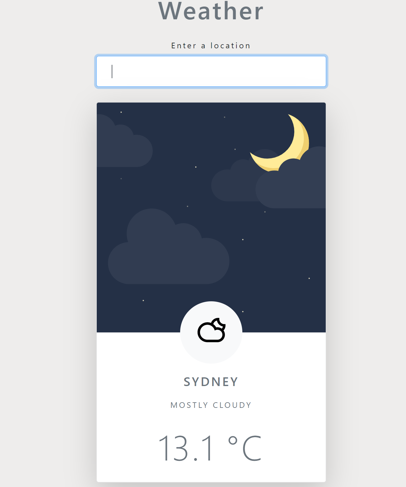

# Weather App

This app was created using JavaScript, CSS and HTML. The user inputs any city name and using the firebase api, the app returns the relevant and latest weather. The UI and icons change depending on the state of the weather.

# Preview

# Author

Simon Maher
